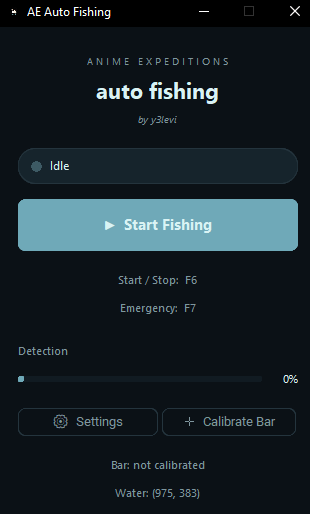

  

  <a href="#-português">🇧🇷 português</a> &nbsp;|&nbsp; <a href="#-english">🇬🇧 english</a>

 

---

## 🇧🇷 português

**AEFISH** é uma macro de pesca automática em loop, feita pro minigame de pesca do anime expeditions (roblox).

funciona sem injetar nada e sem mexer em processo nenhum, ele só analisa o que aparece na tela e mexe o mouse sozinho. simples assim.

funciona com as varas convencionais e com a **AUTOROD** (é só uma tag).

### modos de pesca

- **modo normal** → pras 4 varas comuns do jogo, com o minigame
- **modo autorod** → específico pra AUTOROD, que não tem minigame

### como usar

1. baixa o instalador na aba de [releases](../../releases)
2. instala e abre o **AEFISH**
3. escolhe o modo de pesca
4. deixa rodando e vai fazer outra coisa

tem uma tela de configurações lá dentro também, pra ajustar o que precisar.

  

> pode rodar direto, sem frescura. não precisa entender nada de tecnologia pra usar.

### download

📦 [baixar última versão (.exe)](../../releases/latest)

 

---

## 🇬🇧 english

**AEFISH** is an automatic fishing loop macro, made for anime expeditions' (roblox) fishing minigame.

it doesn't inject anything and doesn't touch any process, it just reads what's on your screen and moves the mouse on its own. that's it.

works with the regular rods and with **AUTOROD** (just a tag).

### fishing modes

- **normal mode** → for the game's 4 common rods, with the minigame
- **autorod mode** → made for AUTOROD, which has no minigame

### how to use

1. download the installer from the [releases](../../releases) tab
2. install it and open **AEFISH**
3. pick your fishing mode
4. let it run and go do something else

there's also a settings screen inside, to tweak whatever you need.

  

> just run it, no need to overthink it.

### download

📦 [download latest version (.exe)](../../releases/latest)
